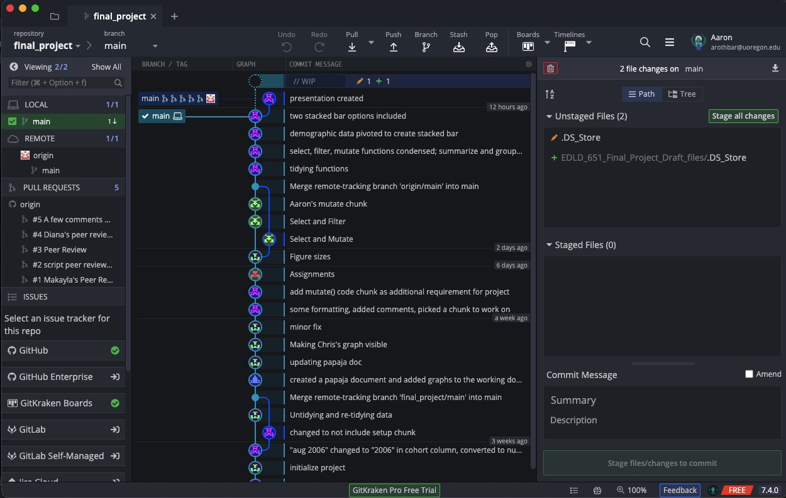
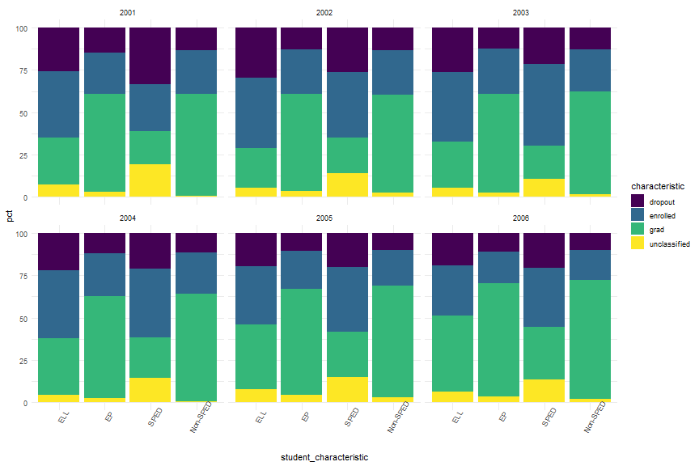
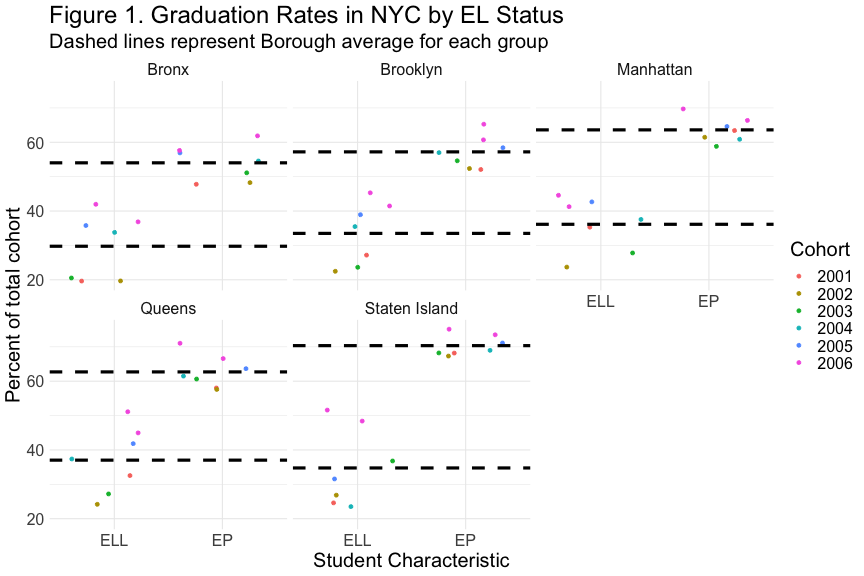
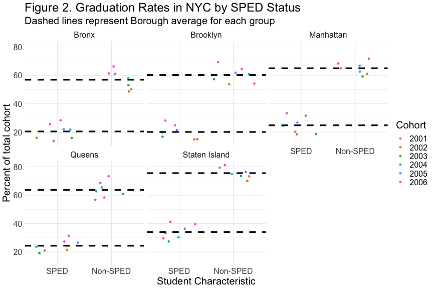

Graduation Outcomes by NYC Burough
========================================================
author: Anwesha Guha, Heidi Iwashita, Christopher Loan, Adam Nielsen, Aaron Rothbart
date: November 30, 2020
autosize: true


Overview
========================================================
- Data
- Journey
- Challenges & Failures
- Successes
- Preliminary Findings
- Where we go from here

Discovering and Learning R
======================================================
left: 60%


***

- Different starting points
- Varied reasons for learning R
- Learned to backtrack and try again
- Not straightforward! 
- Learned from each other

Exploring Options of Data
==========================
- Narrowed overlapping interests
    - Found numerous data sources (criminology, voting, education)
    - Group poll for interested: selected *differential educational outcomes*
      - Modal interest among options
      - Many variables to leverage


Selected Data
===
- [*NYC OpenData*](https://data.cityofnewyork.us/Education/2005-2010-Graduation-Outcomes-By-Borough/avir-tzek)
    - Graduation outcome information (2005 - 2010)
    - Variables of interest (SPED Status & EL Status)


```r
names(grad)
```

```
 [1] "demographic"                           
 [2] "borough"                               
 [3] "cohort"                                
 [4] "total_cohort"                          
 [5] "total_grads_n"                         
 [6] "total_grads_percent_of_cohort"         
 [7] "total_regents_n"                       
 [8] "total_regents_percent_of_cohort"       
 [9] "total_regents_percent_of_grads"        
[10] "advanced_regents_n"                    
[11] "advanced_regents_percent_of_cohort"    
[12] "advanced_regents_percent_of_grads"     
[13] "regents_w_o_advanced_n"                
[14] "regents_w_o_advanced_percent_of_cohort"
[15] "regents_w_o_advanced_percent_of_grads" 
[16] "local_n"                               
[17] "local_percent_of_cohort"               
[18] "local_percent_of_grads"                
[19] "still_enrolled_n"                      
[20] "still_enrolled_percent_of_cohort"      
[21] "dropped_out_n"                         
[22] "dropped_out_percent_of_cohort"         
```


Overcoming Group Challenges
====
- Presentation through R and coordinating
  - solution: email, Zoom, Google docs & searches
- Messy / Poorly Coded Data
  - solution: attention to detail (& tidyverse)


Our Journey with R
======================================================


Adam
======================================================
**Challenges**
- Creativity

***

**Successes**
- Getting the thing started
- Not ruining everything


Aaron
======================================================
**Challenges**

.DS_Store

***

**Successes**
- Collaboration
- Learning to recover files (after ruining everything)
- Data consolidation

Anwesha
====
**Challenges**
- Rpres
- Merge conflicts

***

**Successes**
- Condensing code
- Collaboration
- Using `pivot_longer()` and `pivot_wider()`


Heidi
======================================================
**Challenges**
- Gaining confidence in "R" in general
- No prior knowledge of R
- Supplemented tutorials w/apps Enki and Programming Hub for foundational knowledge

***

**Successes**
- Learned from other group members
- Used "select" and "filter"
- Can now use papaja to write APA paper & add citations
- Gained familiarity with Rpres
- Used "scan" package for anticipated data graphs for dissertation proposal


Chris
======================================================
**Challenges**
- Utilizing GitHub with Others
- Regular Expression & `pivot_longer()` / `pivot_wider()`
    - I have used these for other projects, but always wasted **lots of time**
    - Previously would pivot one variable at a time and use `left_join()` or analogous

***

**Successes**

- Learning to fork, do pull requests, etc. on GitHub
- Better with `pivot_longer()` & `pivot_wider()`
    - still don't get regular expression though :)

Diving into the Data
====
Selecting, Filtering & Mutating

```r
filtered_grad <- clean_grad %>%
  select(c(1:6, 16:22)) %>%
  filter(demographic == "English Language Learners" |
         demographic == "English Proficient Students" |
         demographic == "Special Education" |
         demographic == "General Education") %>% 
  mutate(student_characteristic = 
           factor(demographic, 
                  levels = c("English Language Learners", 
                      "English Proficient Students", 
                      "Special Education", 
                      "General Education"), 
                  labels = c('ELL', 'EP', 'SPED', 'Non-SPED')
                  ))
```


Mutate, cont'd.
======================================================


```r
new_grad <- filtered_grad %>%
  mutate(unclassified_n = total_cohort - (total_grads_n + dropped_out_n + still_enrolled_n),
         unclassified_percent_of_cohort = round(unclassified_n/total_cohort * 100, 1))
```

Graduation Outcomes by Student Classification
===


|student_characteristic | mean_grad_pct| mean_dropout_pct| mean_enrolled_pct| mean_unclassified_pct|
|:----------------------|-------------:|----------------:|-----------------:|---------------------:|
|ELL                    |         34.24|            23.10|             36.59|                  6.08|
|EP                     |         61.58|            11.98|             23.32|                  3.13|
|SPED                   |         24.75|            23.24|             37.78|                 14.24|
|Non-SPED               |         64.27|            11.54|             22.57|                  1.63|

Graduation Outcomes by Borough
===


|borough       | mean_local| mean_grad_pct| mean_dropout_pct| mean_enrolled_pct| mean_unclassified_pct|
|:-------------|----------:|-------------:|----------------:|-----------------:|---------------------:|
|Bronx         |      17.39|         40.29|            20.38|             31.38|                  7.97|
|Brooklyn      |      14.71|         42.76|            18.39|             33.10|                  5.75|
|Manhattan     |      15.39|         47.38|            16.80|             30.05|                  5.77|
|Queens        |      14.71|         46.96|            17.94|             29.92|                  5.18|
|Staten Island |      16.90|         53.66|            13.81|             25.85|                  6.69|

Graduation Outcomes by Student Classification, Faceted by Year
===


% Graduation by English Language Status
========================================================



% Graduation by Special Education Status
========================================================


Take-Aways
===

**EL status**
- Gaps between ELL and EP students appear to display heterogeneity
- certain boroughs (e.g., Staten Island) have much larger gaps between proficiency than others (e.g., Brooklyn)

- From a social justice framework:
    - concerning that Staten Island has the highest graduation % for EP students, and nearly the lowest for ELL students. 
    - redistribution of resources should be considered in such cases

***

**SPED status**
- Gaps between SPED and non-SPED students appear relatively constant across borough
- Some boroughs (i.e., Staten Island & Manhattan) have higher graduation percentages for both groups. 

Next Steps
===

**Inferential statistics:** test if differences are significant

**Consult experts & educational theorists:** 
- identify potential confounding variables which explain the variation in these averages (particularly for ELL/EP); e.g.,
    - School-wide access to funding & resources
    - Percent of teachers that speak languages other than English,
    - Predominant non-English language(s) is/are spoken in each borough
    - Average qualification of SPED/ELL teachers
    - Parental access to (and leverage of) extra-curricular educational resources

**Explore redistribution of resources**

Future Directions in R
===
- Machine Learning
- Data visualization
- Single-subject applications
- Functional applications
