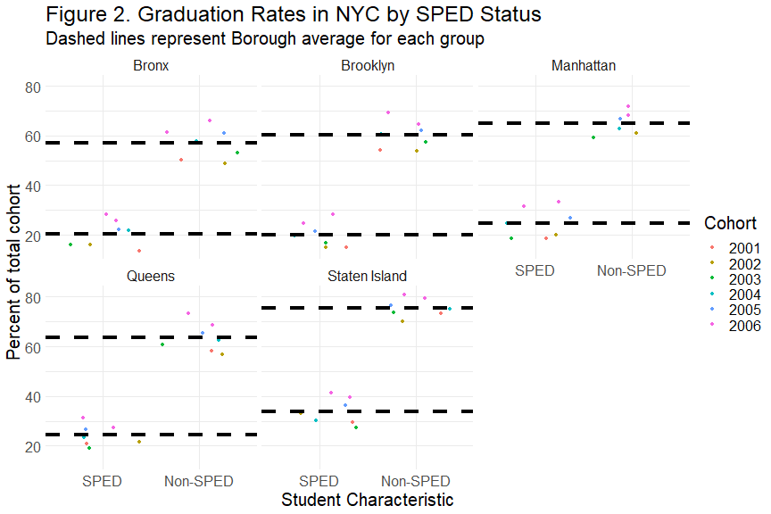

Graduation Outcomes by NYC Burough
========================================================
author: Anwesha Guha, Heidi Iwashita, Christopher Loan, Adam Nielsen, Aaron Rothbart
date: November 30, 2020
autosize: true


Overview
========================================================
- Data
- Journey
- Challenges & Failures
- Successes
- Preliminary Findings
- Where we go from here

Journey
===

- Varied experience & interest in data science
- Indivdual share outs
!!!!PICTURE HERE!!!!

Exploring Options of Data
===
- Narrowed overlapping interests
    - Found numerous data sources (criminology, voting, education)
    - Group poll for interested: selected *differential educational outcomes*
      - Modal interest among options
      - Many variables to leverage


Selected Data
===
- [*NYC OpenData*](https://data.cityofnewyork.us/Education/2005-2010-Graduation-Outcomes-By-Borough/avir-tzek)
    - Graduation outcome information (2005 - 2010)
    - Variables of interest (SPED Status & EL Status)


```r
names(grad)
```

```
 [1] "demographic"                           
 [2] "borough"                               
 [3] "cohort"                                
 [4] "total_cohort"                          
 [5] "total_grads_n"                         
 [6] "total_grads_percent_of_cohort"         
 [7] "total_regents_n"                       
 [8] "total_regents_percent_of_cohort"       
 [9] "total_regents_percent_of_grads"        
[10] "advanced_regents_n"                    
[11] "advanced_regents_percent_of_cohort"    
[12] "advanced_regents_percent_of_grads"     
[13] "regents_w_o_advanced_n"                
[14] "regents_w_o_advanced_percent_of_cohort"
[15] "regents_w_o_advanced_percent_of_grads" 
[16] "local_n"                               
[17] "local_percent_of_cohort"               
[18] "local_percent_of_grads"                
[19] "still_enrolled_n"                      
[20] "still_enrolled_percent_of_cohort"      
[21] "dropped_out_n"                         
[22] "dropped_out_percent_of_cohort"         
```

Diving into the Data (Aaron & Heidi)
====
Selecting, Filtering & Mutating

```r
filtered_grad <- clean_grad %>%
  select(c(1:6, 16:22)) %>%
  filter(demographic == "English Language Learners" |
         demographic == "English Proficient Students" |
         demographic == "Special Education" |
         demographic == "General Education") %>% 
  mutate(student_characteristic = 
           factor(demographic, 
                  levels = c("English Language Learners", 
                      "English Proficient Students", 
                      "Special Education", 
                      "General Education"), 
                  labels = c('ELL', 'EP', 'SPED', 'Non-SPED')
                  ))
```

Overcoming Challenges
====
- .DS_store (Aaron)
  - solution: Collaboration!
- GitHub (Chris)
  - solution: Doing what works 
- Presentation through R (Anwesha)
  - solution: Self-teaching & Online Tutorials
- Messy / Poorly Coded Data
  - solution: attention to detail (& tidyverse)
!!!!! ADAM & HEIDI !!!!!


```r
new_grad <- filtered_grad %>%
  mutate(unclassified_n = total_cohort - (total_grads_n + dropped_out_n + still_enrolled_n),
         unclassified_percent_of_cohort = round(unclassified_n/total_cohort * 100, 1))
```


===


```r
demographic_data <- new_grad %>% 
  group_by(student_characteristic, cohort) %>% 
  summarize(mean_grad_pct = mean(total_grads_percent_of_cohort),
            mean_dropout_pct = mean(dropped_out_percent_of_cohort),
            mean_enrolled_pct = mean(still_enrolled_percent_of_cohort),
            mean_unclassified_pct = mean(unclassified_percent_of_cohort))
# ADD A TABLE
```

===


```r
# group by borough, look at % of local students
# consider a map
borough_data <- new_grad %>% 
  group_by(borough, cohort) %>% 
  summarize(mean_local = mean(local_percent_of_cohort),
            mean_grad_pct = mean(total_grads_percent_of_cohort),
            mean_dropout_pct = mean(dropped_out_percent_of_cohort),
            mean_enrolled_pct = mean(still_enrolled_percent_of_cohort),
            mean_unclassified_pct = mean(unclassified_percent_of_cohort))
```

EL Graph
========================================================


SPED Graph
========================================================


