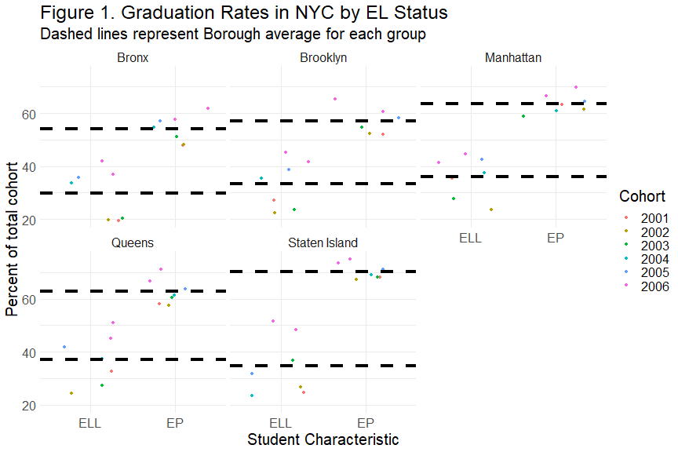

Graduation Outcomes by NYC Burough
========================================================
author: Anwesha Guha, Heidi Iwashita, Christopher Loan, Adam Nielsen, Aaron Rothbart
date: November 30, 2020
autosize: true


Overview
========================================================
- Data
- Journey
- Challenges & Failures
- Successes
- Preliminary Findings
- Where we go from here

Journey
======================================================
title: false
left: 60%


***

- Different starting points
- Varied reasons for learning R
- Learned to backtrack and try again
- Not straightforward! 
- Learned from each other

Exploring Options of Data
==========================
- Narrowed overlapping interests
    - Found numerous data sources (criminology, voting, education)
    - Group poll for interested: selected *differential educational outcomes*
      - Modal interest among options
      - Many variables to leverage


Selected Data
===
- [*NYC OpenData*](https://data.cityofnewyork.us/Education/2005-2010-Graduation-Outcomes-By-Borough/avir-tzek)
    - Graduation outcome information (2005 - 2010)
    - Variables of interest (SPED Status & EL Status)


```r
names(grad)
```

```
 [1] "demographic"                           
 [2] "borough"                               
 [3] "cohort"                                
 [4] "total_cohort"                          
 [5] "total_grads_n"                         
 [6] "total_grads_percent_of_cohort"         
 [7] "total_regents_n"                       
 [8] "total_regents_percent_of_cohort"       
 [9] "total_regents_percent_of_grads"        
[10] "advanced_regents_n"                    
[11] "advanced_regents_percent_of_cohort"    
[12] "advanced_regents_percent_of_grads"     
[13] "regents_w_o_advanced_n"                
[14] "regents_w_o_advanced_percent_of_cohort"
[15] "regents_w_o_advanced_percent_of_grads" 
[16] "local_n"                               
[17] "local_percent_of_cohort"               
[18] "local_percent_of_grads"                
[19] "still_enrolled_n"                      
[20] "still_enrolled_percent_of_cohort"      
[21] "dropped_out_n"                         
[22] "dropped_out_percent_of_cohort"         
```


Overcoming Challenges
====
- .DS_store (Aaron)
  - solution: Collaboration!
- Presentation through R and coordinating (Anwesha)
  - solution: Self-teaching & Online Tutorials
- Messy / Poorly Coded Data (Adam & Heidi)
  - solution: attention to detail (& tidyverse)

Successes
======================================================
left: 60%


***

- Adam
- Anwesha
- Heidi
- Chris
- Aaron

Anwesha
======================================================


Chris
======================================================
**Challenges**
- Utilizing GitHub with Others
- Regular Expression & `pivot_longer()` / `pivot_wider()`
    - I have used these for other projects, but always wasted **lots of time**
    - Previously would pivot one variable at a time and use `left_join()` or analogous

***

**Successess**

- Learning to fork, do pull requests, etc. on GitHub
- Better with `pivot_longer()` & `pivot_wider()`
    - still don't get regular expression though :)

Adam
======================================================
**Challenges**
- Creativity

**Successes**
- Getting the thing started
- Not ruining everything

***

**Next Hurdle**
- Machine Learning


Diving into the Data (Aaron & Heidi)
====
Selecting, Filtering & Mutating

```r
filtered_grad <- clean_grad %>%
  select(c(1:6, 16:22)) %>%
  filter(demographic == "English Language Learners" |
         demographic == "English Proficient Students" |
         demographic == "Special Education" |
         demographic == "General Education") %>% 
  mutate(student_characteristic = 
           factor(demographic, 
                  levels = c("English Language Learners", 
                      "English Proficient Students", 
                      "Special Education", 
                      "General Education"), 
                  labels = c('ELL', 'EP', 'SPED', 'Non-SPED')
                  ))
```

Heidi
======================================================
**Gaining confidence in "R" in general:**
- No prior knowledge of R
- Supplemented tutorials w/apps Enki and Programming Hub for foundational knowledge
- Used "scan" package for anticipated data graphs for dissertation proposal

***

**Successes in this project:**
- Learned from other group members
- Used "select" and "filter"
- Can now use papaja to write APA paper & add citations
- Gained familiarity with Rpres

Mutate
======================================================


```r
new_grad <- filtered_grad %>%
  mutate(unclassified_n = total_cohort - (total_grads_n + dropped_out_n + still_enrolled_n),
         unclassified_percent_of_cohort = round(unclassified_n/total_cohort * 100, 1))
```


===


```r
demographic_data <- new_grad %>% 
  group_by(student_characteristic, cohort) %>% 
  summarize(mean_grad_pct = mean(total_grads_percent_of_cohort),
            mean_dropout_pct = mean(dropped_out_percent_of_cohort),
            mean_enrolled_pct = mean(still_enrolled_percent_of_cohort),
            mean_unclassified_pct = mean(unclassified_percent_of_cohort))
# ADD A TABLE
```

===


```r
# group by borough, look at % of local students
# consider a map
borough_data <- new_grad %>% 
  group_by(borough, cohort) %>% 
  summarize(mean_local = mean(local_percent_of_cohort),
            mean_grad_pct = mean(total_grads_percent_of_cohort),
            mean_dropout_pct = mean(dropped_out_percent_of_cohort),
            mean_enrolled_pct = mean(still_enrolled_percent_of_cohort),
            mean_unclassified_pct = mean(unclassified_percent_of_cohort))
```

% Graduation by English Language Status
========================================================


% Graduation by Special Education Status
========================================================


Take-aways
===

**EL status**
Gaps between ELL and EP students appear to display heterogeneity, such that certain boroughs (e.g., Staten Island) have much larger gaps between proficiency than others (e.g., Brooklyn). From a social justice framework, it is particularly concerning that Staten Island has the highest graduation % for EP students, and nearly the lowest for ELL students.

***

**SPED status**
Gaps between SPED and non-SPED students appear relatively constant across borough, with some boroughs (i.e., Staten Island & Manhattan) having higher graduation percentages for both groups. 

Next steps
===

- Inferential statistics should follow these descriptive methods to see if this differences are significant. 
- Educational theorists should be consulted to advise potential confounding variables can explain the variation in these averages (e.g., access to resources, percent of teachers that speak languages other than English, or which non-English language(s) is/are spoken in each borough)
